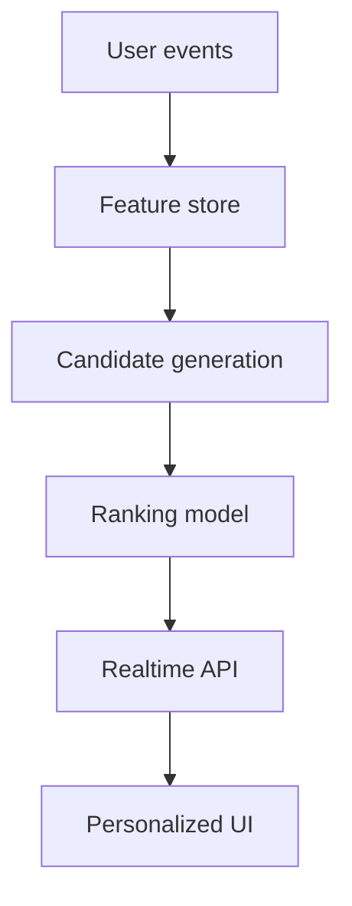

Case studies shine when readers can verify the underlying code. This example highlights a recommendation engine project, pulling GitHub stats directly into the narrative and linking supporting resources.

## Project overview

- **Client:** Streaming media startup scaling personalization
- **Role:** Lead machine learning engineer
- **Timeline:** Q1 2024 (8 weeks)

## Repository snapshot

> **Why it matters:** Badges refresh automatically so stakeholders always see the latest adoption metrics.

## Architecture

## Outcomes

| KPI | Baseline | Post-launch |
|-----|----------|-------------|
| Recommendation CTR | 4.8% | **6.0%** |
| Hours streamed / user | 5.1 | **6.3** |
| Support tickets / week | 18 | **11** |

## Supporting assets

- `_notebooks/recsys-evaluation.ipynb` – Offline evaluation and fairness analysis
- `_datasets/recsys-segment-metrics.csv` – Segment-level KPI tracking
- `_portfolio/market-segmentation-case-study.md` – Extended client background

Wrap up by inviting readers to clone the repo, run the notebooks, and explore the dashboards embedded elsewhere on the site.
